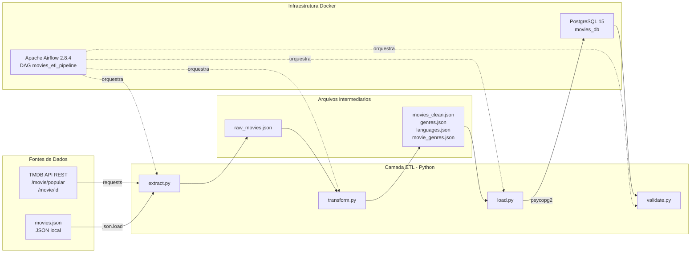
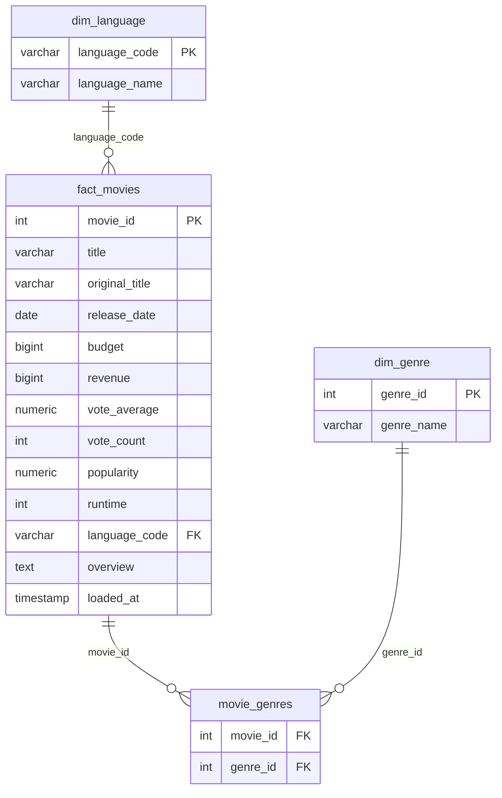
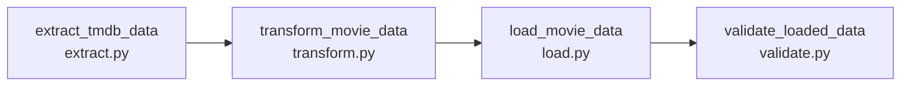

# Pipeline de Integração de Dados End-to-End — TMDB Movies

---

**Disciplina:** Data Integration  
**Curso:** Sistemas de Informação  
**Instituição:** ESPM  
**Semestre:** 2026.1  
**Professor:** Prof. Me. Andre Insardi  

**Integrantes do grupo:**

- Felipe de Arruda Botelho
- Luca de Donato Paulillo
- Luigi Van Hoesel Tomassone
- Matheus Asael Silva Macedo
- Vinicius Eduardo Tinoco da Silva

**Repositório GitHub:** https://github.com/lucaddonato/data-integration  
**Data de entrega:** 24/05/2026

---

\newpage

## Sumário Executivo

Este relatório descreve o desenvolvimento de um pipeline de integração de dados end-to-end no domínio de cinema, desenvolvido como trabalho semestral da disciplina Data Integration (ESPM — Sistemas de Informação, 2026.1). O projeto simula um cenário corporativo em que uma equipe de Engenharia de Dados precisa consolidar informações de filmes provenientes de fontes heterogêneas em um banco analítico, com orquestração, validação de qualidade e reprodutibilidade via containerização.

A solução implementada extrai dados de duas fontes distintas — a API REST do TMDB (The Movie Database) e um arquivo JSON local semi-estruturado —, aplica regras de transformação e validação em Python, carrega os dados em um modelo dimensional no PostgreSQL 15 e orquestra todo o fluxo por meio de uma DAG do Apache Airflow 2.8.4 executada em contêineres Docker.

O pipeline atende aos requisitos obrigatórios do enunciado: duas fontes heterogêneas, pelo menos uma fonte semi-estruturada, ETL modularizado, ambiente containerizado, DAG com quatro tasks e dependências, modelagem dimensional (1 fato + 2 dimensões), validações de qualidade e consultas analíticas de valor para o usuário final. Como itens desejáveis, o projeto inclui testes automatizados com pytest, logs estruturados em JSON e uso de variáveis de ambiente para credenciais da API.

Os principais resultados obtidos após a execução do pipeline incluem a carga de filmes na tabela fato, gêneros e idiomas nas dimensões, e relações na tabela bridge `movie_genres`, conforme detalhado na seção 7. Três consultas SQL de valor demonstram análises de receita e ROI, distribuição por gênero e avaliação média por idioma original — informações relevantes para stakeholders do setor de entretenimento.

As principais limitações identificadas são a dependência de conectividade com a API externa, a ausência de dashboard visual e credenciais parcialmente hardcoded no módulo de carga. Como evoluções futuras, propõe-se carga incremental por data, CI/CD com GitHub Actions e um dashboard em Streamlit consumindo o Postgres.

---

\newpage

## 1. Descrição do Problema e Justificativa do Tema

### 1.1 Contexto do problema

Empresas do setor de entretenimento — plataformas de streaming, distribuidoras e produtoras — dependem de dados consolidados sobre filmes para tomar decisões de catálogo, investimento em produção e estratégias de marketing. Essas informações costumam estar dispersas em APIs públicas, bases proprietárias e arquivos exportados manualmente, o que exige pipelines de integração capazes de extrair, padronizar, validar e disponibilizar os dados em um repositório analítico confiável.

No contexto acadêmico da disciplina Data Integration, o desafio proposto é reproduzir esse cenário corporativo com ferramentas da stack vista em aula: Python, Docker, Apache Airflow e PostgreSQL.

### 1.2 Justificativa da escolha do tema

O domínio de **filmes e dados do TMDB** foi escolhido pelos seguintes motivos:

1. **Relevância de negócio:** métricas como receita, orçamento, avaliação e popularidade são compreensíveis por stakeholders não técnicos e permitem análises de ROI e tendências de catálogo.
2. **Disponibilidade de fontes públicas:** a API do TMDB é gratuita, documentada e amplamente utilizada no mercado.
3. **Heterogeneidade natural:** combinar uma API REST com um arquivo JSON local atende ao requisito de fontes heterogêneas sem depender de infraestrutura complexa.
4. **Adequação ao modelo dimensional:** filmes (fato) se relacionam naturalmente com dimensões de gênero e idioma, facilitando consultas analíticas.
5. **Reprodutibilidade:** o pipeline pode ser executado do zero em qualquer máquina com Docker, bastando configurar a chave de API.

### 1.3 Objetivo do projeto

Construir um pipeline ETL operacional, documentável e reprodutível que:

- Extraia dados de pelo menos duas fontes heterogêneas;
- Transforme os dados com regras de negócio e validações de qualidade;
- Carregue os dados em PostgreSQL com modelagem dimensional;
- Orquestre o fluxo com Apache Airflow;
- Disponibilize consultas analíticas de valor para um usuário final.

---

## 2. Arquitetura da Solução

### 2.1 Visão geral

A arquitetura adota um padrão **ETL em camadas**, com separação clara de responsabilidades entre extração, transformação, carga e validação. O Apache Airflow atua como orquestrador, executando scripts Python em sequência dentro de um contêiner dedicado. O PostgreSQL funciona como camada de persistência analítica, com schema criado automaticamente na inicialização do contêiner.

### 2.2 Diagrama de arquitetura



### 2.3 Stack tecnológica

| Camada | Ferramenta | Versão |
|---|---|---|
| Linguagem | Python | 3.10 |
| Conteinerização | Docker + Docker Compose | 24+ |
| Orquestração | Apache Airflow | 2.8.4 |
| Banco de dados | PostgreSQL | 15 |
| Bibliotecas Python | pandas, requests, psycopg2-binary, pytest | — |
| Versionamento | Git + GitHub | — |

### 2.4 Estrutura do repositório

```
data-integration/
├── dags/           # DAG do Airflow
├── etl/            # Módulos extract, transform, load, validate, logger
├── sql/            # Schema inicial do Postgres (init.sql)
├── tests/          # Testes unitários (pytest)
├── data/           # Fonte JSON local e arquivos intermediários
├── docs/           # Documentação (este relatório)
├── Dockerfile
├── docker-compose.yml
└── requirements.txt
```

### 2.5 Decisões arquiteturais

| Decisão | Justificativa |
|---|---|
| Modelo dimensional (star schema) | Facilita consultas analíticas com JOINs simples entre fato e dimensões |
| Arquivos JSON como staging | Desacopla etapas do ETL; permite reprocessar transformação sem reextrair da API |
| BashOperator no Airflow | Simplicidade e aderência ao padrão visto em aula; cada task executa um script Python |
| `ON CONFLICT DO UPDATE` na carga | Permite reexecuções idempotentes sem duplicar registros |
| Logs estruturados em JSON | Facilita monitoramento e filtragem nos Task Logs do Airflow |

---

## 3. Detalhamento das Fontes de Dados e Regras de Transformação

### 3.1 Fonte 1 — TMDB API (REST)

| Atributo | Detalhe |
|---|---|
| Tipo | API REST (JSON) |
| URL base | `https://api.themoviedb.org/3` |
| Endpoints utilizados | `/movie/popular` (páginas 1 e 2) e `/movie/{id}` |
| Autenticação | API Key via variável de ambiente `TMDB_API_KEY` |
| Volume estimado | ~40 filmes por execução (20 por página × 2 páginas) |
| Campos relevantes | `id`, `title`, `original_title`, `release_date`, `budget`, `revenue`, `vote_average`, `vote_count`, `popularity`, `runtime`, `original_language`, `overview`, `genres`, `spoken_languages` |

**Fluxo de extração:** o módulo `extract.py` busca os filmes populares e, para cada um, consulta o endpoint de detalhes para obter campos completos (gêneros, orçamento, duração etc.). Falhas individuais na API são registradas como warning e não interrompem o pipeline.

### 3.2 Fonte 2 — Arquivo JSON local

| Atributo | Detalhe |
|---|---|
| Tipo | JSON semi-estruturado (arquivo local) |
| Caminho | `data/movies.json` |
| Conteúdo | Dados detalhados do filme *Fight Club* (id=550) |
| Finalidade | Garantir uma segunda fonte heterogênea e servir como fallback caso o filme não esteja na lista popular da API |

**Mesclagem:** após a extração da API, o JSON local é carregado. Se o filme local não estiver presente na lista da API, é adicionado ao conjunto bruto. Em seguida, deduplicação por `id` remove registros repetidos.

### 3.3 Regras de transformação

As transformações são implementadas em `etl/transform.py` com pandas:

| Etapa | Descrição |
|---|---|
| Normalização de campos | Seleção e renomeação dos campos relevantes para o modelo dimensional |
| Extração de dimensões | `extract_genres()` e `extract_languages()` geram listas únicas de gêneros e idiomas |
| Relacionamento N:N | `build_movie_genres()` monta pares `(movie_id, genre_id)` para a tabela bridge |
| Validação de nulos | Remove registros sem `id` ou `title`; preenche nulos em campos numéricos com 0 |
| Validação de duplicatas | Mantém o registro com maior `vote_count` por `id` |
| Validação de ranges | Corrige `vote_average` fora de [0,10], valores negativos de budget/revenue e runtime inválido |

**Arquivos gerados pela transformação:**

| Arquivo | Conteúdo |
|---|---|
| `movies_clean.json` | Filmes validados e normalizados |
| `genres.json` | Dimensão de gêneros |
| `languages.json` | Dimensão de idiomas |
| `movie_genres.json` | Relações filme-gênero |

---

## 4. Modelagem do Banco de Dados

### 4.1 Escolha do modelo

Foi adotado um **modelo dimensional (star schema)** com uma tabela fato (`fact_movies`), duas dimensões (`dim_genre`, `dim_language`) e uma tabela bridge (`movie_genres`) para o relacionamento N:N entre filmes e gêneros.

### 4.2 Diagrama entidade-relacionamento



### 4.3 Definição das tabelas

O schema é criado automaticamente pelo script `sql/init.sql` na inicialização do contêiner PostgreSQL:

**dim_genre** — dimensão de gêneros cinematográficos  
**dim_language** — dimensão de idiomas originais  
**fact_movies** — tabela fato com métricas e atributos do filme  
**movie_genres** — tabela bridge para relacionamento N:N filme ↔ gênero

Restrições de integridade:

- `fact_movies.title` é `NOT NULL`
- `fact_movies.language_code` referencia `dim_language.language_code`
- `movie_genres` referencia `fact_movies` e `dim_genre` com `ON DELETE CASCADE`
- Chave primária composta em `movie_genres (movie_id, genre_id)`

---

## 5. Descrição da DAG do Airflow

### 5.1 Configuração

| Parâmetro | Valor |
|---|---|
| `dag_id` | `movies_etl_pipeline` |
| Arquivo | `dags/teste-1.py` |
| `start_date` | 01/01/2025 |
| `schedule` | `@daily` |
| `catchup` | `False` |

### 5.2 Tasks e dependências



| Task ID | Script | Função |
|---|---|---|
| `extract_tmdb_data` | `etl/extract.py` | Extrai dados da API TMDB e do JSON local; salva `raw_movies.json` |
| `transform_movie_data` | `etl/transform.py` | Aplica validações e gera arquivos limpos e dimensões |
| `load_movie_data` | `etl/load.py` | Carrega dimensões, fato e bridge no PostgreSQL |
| `validate_loaded_data` | `etl/validate.py` | Executa validações pós-carga; falha a task se alguma regra não for atendida |

Todas as tasks utilizam `BashOperator` e são encadeadas linearmente (`extract >> transform >> load >> validate`). Em caso de falha em qualquer etapa, as tasks subsequentes não são executadas.

### 5.3 Execução

1. Subir o ambiente: `docker compose up --build`
2. Acessar o Airflow em `http://localhost:8080` (admin / admin)
3. Disparar a DAG manualmente via **Trigger DAG** ou aguardar o agendamento diário
4. Acompanhar execução no **Graph View** e logs JSON em cada task

---

## 6. Validações de Qualidade Implementadas

As validações estão divididas em duas camadas: **pré-carga** (durante a transformação) e **pós-carga** (após inserção no banco).

### 6.1 Validações na transformação (`etl/transform.py`)

| # | Regra | Condição | Ação |
|---|---|---|---|
| 1 | Nulos obrigatórios | `id` ou `title` nulos | Remove o registro |
| 1b | Nulos opcionais | `vote_average`, `budget`, `revenue` etc. nulos | Preenche com 0 |
| 2 | Duplicidades | Mesmo `id` em mais de um registro | Mantém o de maior `vote_count` |
| 3 | Range — nota | `vote_average` fora de [0, 10] | Define como `NULL` |
| 3b | Range — financeiro | `budget` ou `revenue` negativos | Define como 0 |
| 3c | Range — duração | `runtime` ≤ 0 | Define como `NULL` |

### 6.2 Validações pós-carga (`etl/validate.py`)

| # | Regra | Query de verificação | Comportamento em falha |
|---|---|---|---|
| 4 | Sem títulos nulos | `COUNT(*) WHERE title IS NULL = 0` | `ValueError` — task falha |
| 5 | Sem duplicatas | `COUNT(*) - COUNT(DISTINCT movie_id) = 0` | `ValueError` — task falha |
| 6 | Range de nota no banco | `vote_average NOT BETWEEN 0 AND 10 = 0` | `ValueError` — task falha |
| 7 | Integridade referencial | `movie_genres` sem correspondência em `dim_genre = 0` | `ValueError` — task falha |

### 6.3 Monitoramento

Todos os módulos ETL utilizam um logger estruturado em JSON (`etl/logger.py`), com campos `timestamp`, `level`, `logger` e `message`. Os logs são visíveis nos Task Logs do Airflow, permitindo rastrear cada regra aplicada e identificar falhas.

### 6.4 Testes automatizados

As funções puras de transformação são cobertas por **27 testes unitários** em `tests/test_transform.py` (pytest), incluindo cenários de nulos, duplicatas, ranges, extração de gêneros/idiomas e montagem de relações.

---

## 7. Resultados

### 7.1 Resumo da execução

Após execução bem-sucedida da DAG, o módulo `validate.py` registra um resumo com os totais carregados em cada tabela do banco analítico.

| Tabela | Registros carregados |
|---|---|
| `fact_movies` | filmes |
| `dim_genre` | gêneros |
| `dim_language` | idiomas |
| `movie_genres` | relações filme-gênero |

### 7.2 Consulta 1 — Top 10 filmes por receita e ROI

**Objetivo de negócio:** identificar os filmes com maior retorno financeiro e calcular o ROI percentual (receita vs. orçamento).

```sql
SELECT title, revenue, budget,
       ROUND((revenue - budget) / NULLIF(budget, 0)::numeric * 100, 1) AS roi_pct
FROM fact_movies
WHERE budget > 0
ORDER BY revenue DESC
LIMIT 10;
```

---

### 7.3 Consulta 2 — Gêneros com mais filmes

**Objetivo de negócio:** entender a composição do catálogo por gênero, útil para decisões de aquisição e programação.

```sql
SELECT dg.genre_name, COUNT(*) AS total_filmes
FROM movie_genres mg
JOIN dim_genre dg ON mg.genre_id = dg.genre_id
GROUP BY dg.genre_name
ORDER BY total_filmes DESC;
```

---

### 7.4 Consulta 3 — Média de avaliação por idioma original

**Objetivo de negócio:** comparar a qualidade percebida (nota média) dos filmes agrupados por idioma original.

```sql
SELECT dl.language_name, COUNT(*) AS filmes,
       ROUND(AVG(fm.vote_average), 2) AS media_nota
FROM fact_movies fm
JOIN dim_language dl ON fm.language_code = dl.language_code
GROUP BY dl.language_name
ORDER BY media_nota DESC;
```

---

## 8. Limitações e Possíveis Evoluções

### 8.1 Limitações identificadas

| Limitação | Impacto |
|---|---|
| Dependência da API TMDB | Falhas de rede ou rate limit podem reduzir o volume de dados extraídos |
| Volume limitado de dados | Apenas 2 páginas de filmes populares (~40 registros) por execução |
| Credenciais do Postgres hardcoded | Usuário e senha estão fixos em `load.py` e `validate.py` (apenas a API usa `.env`) |
| Sem dashboard visual | Consultas exigem cliente SQL; não há interface para usuário final |
| Sem CI/CD | Testes e lint não rodam automaticamente no GitHub |
| DAG sem retries configurados | Falhas transitórias (ex.: Postgres ainda iniciando) não são reattemptadas automaticamente |
| Arquivo JSON local estático | O fallback local não é atualizado automaticamente |

### 8.2 Evoluções futuras

1. **Carga incremental** — extrair apenas filmes novos ou alterados desde a última execução, usando `loaded_at` ou watermark por data.
2. **Dashboard em Streamlit** — interface web consumindo o Postgres com gráficos de receita, gêneros e avaliações.
3. **CI/CD com GitHub Actions** — pipeline automatizado rodando pytest e lint a cada push.
4. **Variáveis de ambiente completas** — mover credenciais do Postgres para `.env`.
5. **Retries na DAG** — configurar `retries` e `retry_delay` nas tasks do Airflow.
6. **Enriquecimento de dados** — integrar mais endpoints do TMDB (elenco, produtoras, países).
7. **Camada de Data Quality formal** — adotar Great Expectations ou Soda Core para validações declarativas.

---

## 9. Uso de Inteligência Artificial

Conforme política do professor, declaramos o uso de assistentes de IA neste projeto. Todas as sugestões geradas foram **revisadas, testadas e compreendidas** pelos integrantes do grupo, que assumem integral responsabilidade pelo código e pela documentação entregues.

### 9.1 Cursor — modelo Composer 2.5

O **Cursor** (IDE com agente de IA integrado), utilizando o modelo **Composer 2.5**, foi empregado nas seguintes etapas:

| Etapa | Descrição do uso |
|---|---|
| Logging estruturado | Implementação do módulo `etl/logger.py` com `JsonFormatter`, substituindo o formato de texto plano por logs em JSON com campos `timestamp`, `level`, `logger` e `message` |
| Documentação | Atualização da seção de logging no `README.md` com exemplos do novo formato |
| Revisão do projeto | Análise do repositório em relação aos requisitos do enunciado do trabalho semestral, identificando itens atendidos e pendências |

O Composer 2.5 atuou principalmente como agente de codificação dentro do editor, gerando e aplicando alterações diretamente nos arquivos do projeto sob supervisão dos integrantes.

### 9.2 Claude — modelos Sonnet 4.6 e Opus 4.8 (Anthropic)

Os modelos **Claude Sonnet 4.6** e **Claude Opus 4.8**, acessados via interface web e integração no Cursor, foram utilizados nas etapas de maior complexidade arquitetural e de depuração:

| Etapa | Modelo | Descrição do uso |
|---|---|---|
| Arquitetura do pipeline | Opus 4.8 | Sugestão da arquitetura end-to-end: separação em módulos ETL, uso de staging em JSON, modelo dimensional star schema e orquestração linear no Airflow |
| Estruturação do projeto | Sonnet 4.6 | Definição da organização de pastas (`/dags`, `/etl`, `/sql`, `/tests`, `/data`), convenções de nomenclatura e fluxo de dados entre etapas |
| Modelagem do banco | Opus 4.8 | Proposta das tabelas `fact_movies`, `dim_genre`, `dim_language` e `movie_genres`, com justificativa do relacionamento N:N via tabela bridge |
| Testes automatizados | Sonnet 4.6 | Geração dos 27 testes unitários em `tests/test_transform.py`, cobrindo funções de validação de nulos, duplicatas, ranges e extração de dimensões |
| Correção de erros | Sonnet 4.6 / Opus 4.8 | Depuração de falhas no `docker-compose.yml` (ordem de inicialização dos serviços), ajustes na DAG do Airflow e correções na lógica de carga com `ON CONFLICT` |
| Relatório e apresentação | Sonnet 4.6 | Elaboração da estrutura deste relatório técnico e do roteiro para o vídeo de apresentação |

### 9.3 Declaração de responsabilidade

O grupo declara que:

1. Todo código sugerido por IA foi executado, testado e validado manualmente antes de ser incorporado ao repositório;
2. Os integrantes são capazes de explicar cada módulo do pipeline (extração, transformação, carga, validação e orquestração) em apresentação oral;
3. Nenhum repositório externo foi copiado integralmente — as sugestões de IA foram adaptadas ao escopo e às decisões do grupo.

---

## 10. Referências Bibliográficas

APACHE SOFTWARE FOUNDATION. **Apache Airflow Documentation**. Disponível em: https://airflow.apache.org/docs/. Acesso em: 24 maio 2026.

ASSOCIAÇÃO BRASILEIRA DE NORMAS TÉCNICAS. **NBR 6023**: Informação e documentação – Referências – Elaboração. Rio de Janeiro, 2018.

DOCKER INC. **Docker Documentation**. Disponível em: https://docs.docker.com/. Acesso em: 24 maio 2026.

MCKINNEY, Wes. **Python for Data Analysis**. 3. ed. Sebastopol: O'Reilly Media, 2022.

POSTGRESQL GLOBAL DEVELOPMENT GROUP. **PostgreSQL 15 Documentation**. Disponível em: https://www.postgresql.org/docs/15/. Acesso em: 24 maio 2026.

THE MOVIE DATABASE (TMDB). **TMDB API Documentation**. Disponível em: https://developer.themoviedb.org/docs. Acesso em: 24 maio 2026.

THE MOVIE DATABASE (TMDB). **Getting Started**. Disponível em: https://developer.themoviedb.org/reference/intro/getting-started. Acesso em: 24 maio 2026.

---

*Relatório elaborado para a disciplina Data Integration — ESPM, 2026.1.*
